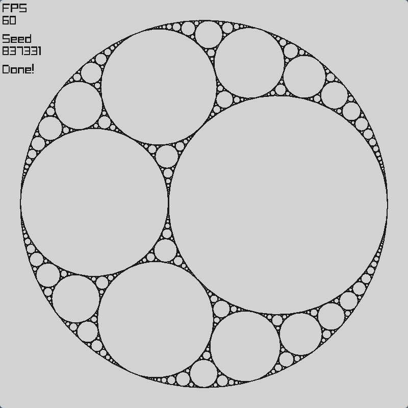
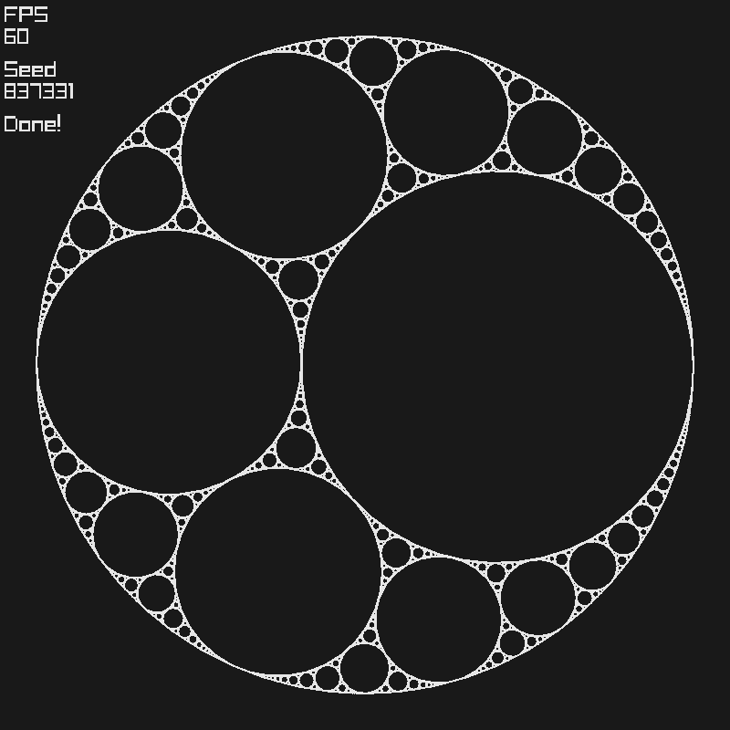

# Apollonian Gasket

This is a recreation of the coding challenge [Apollonian Gasket](https://www.youtube.com/watch?v=6UlGLB_jiCs) ([thecodingtrain.com link](https://thecodingtrain.com/challenges/182-apollonian-gasket)) in C.

## Running it for yourself

If you want executables, go to [releases](https://github.com/gstaaij/codingtrain/releases/tag/apollonianv1.0.0) and download them from there.

If you want to build it yourself, just run `make`.
(If you want to be able to build for Windows, you must install MinGW. I won't provide any instructions on how to do that here)

## Screenshots

*(You can enable dark mode by passing `--dark` as a command line argument)*
